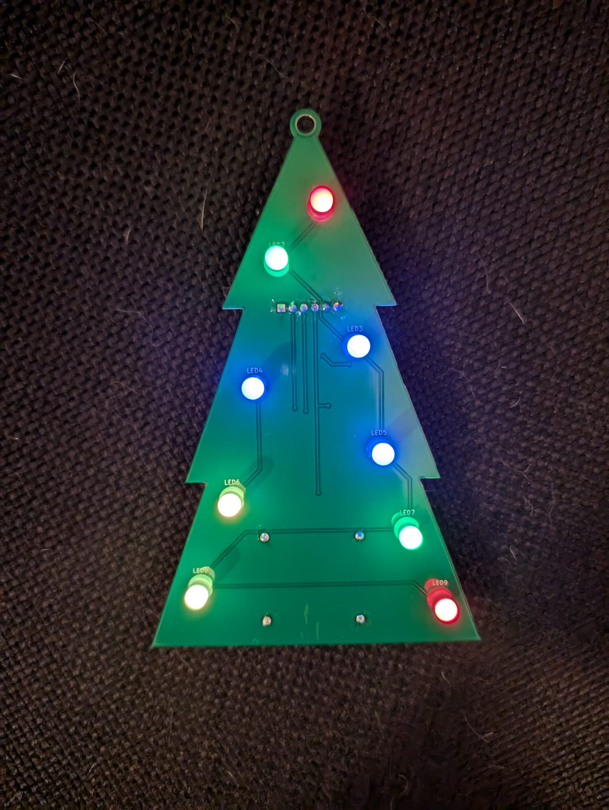

# XmasTreePCB

## Overview
This is a simple and customizable RGB Xmas tree.

## Features
- [x] **ESP32 Controlled**: Easy to program MCU.
- [x] **Neopixels**: Easy to use RGB LEDs.

## Media

    
Images

)

    
Video

## Contributing
Contributions are welcome! Please fork the repository and submit a pull request with your changes.